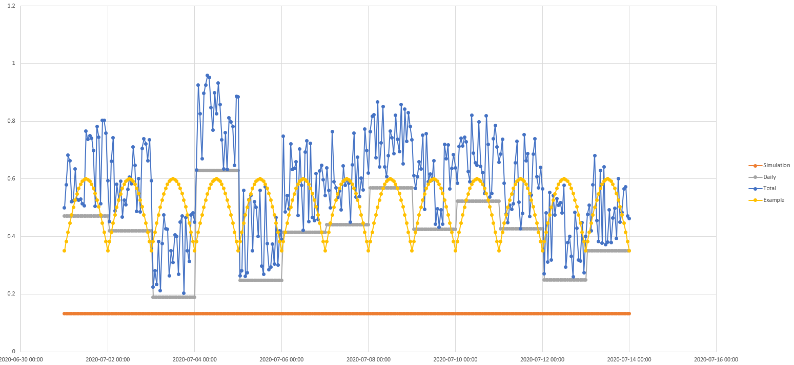
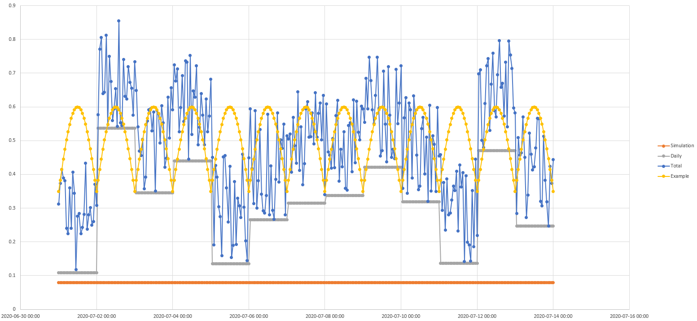

// settings.adoc
[[settings.ini]]

The settings.ini file contains a number of definitions that allow FireSTARR to find the information it requires more rapidly as well as a number of constants for use within your simulation.

## Critical components
The fuel look up table (how FireStarr knows what the numbers in your fuel grid represent), the root to your raster data, and the output date offsets (what your forecast horrizons are).

`RASTER_ROOT` = ./generated/grid/100m Root directory to read rasters from. FireSTARR will read from this location without explicit definition

`MINIMUM_ROS` = 0.0Minimum rate of spread before fire is considered to actually be spreading. If this is above 0 it would yield results where the fire is not moving so long as the rate of spread is below the value defined here.

`MAX_SPREAD_DISTANCE` = 0.4 Maximum distance that head can spread per step (* cell size).This setting will ensure very fast fires are polling the underlying data so it's always spreading the fuels represented by the underlying grid. If you go beyond 1 assessments of the fuel grid would not

`OUTPUT_DATE_OFFSETS` = [1,2,3,7,14] Days to output probability contours for. In this case, days 1, 2, 3 7 and 14 days.

`FUEL_LOOKUP_TABLE` = ./fuel.lut Lookup table (LUT) for fuels (prometheus format). The Lookup table is also the location where you would provide meaningful overrides for non-fuels. The LUT that is shipped with FireSTARR has non-fuels (except water) being turned into D-2 or some low conifer M series fuel. This ensure some spread through non-fuel.

`MINIMUM_FFMC` = 65.0 Minimum ffmc for fire to spread. This is essentially a global burning condition, without an FFMC over 65, fire will not spread.

`MINIMUM_FFMC_AT_NIGHT` = 85.0 Minimum ffmc for fire to spread at night. This is essentially a global burning condition, without an FFMC over 85, fire will not spread.

`OFFSET_SUNRISE` = 0.0 Time after sunrise to start burning (hours). Another global burning condition to limit fire spread.

`OFFSET_SUNSET` = 0.0 Time before sunset to stop burning (hours). Another global burning condition to limit fire spread.

`THRESHOLD_SCENARIO_WEIGHT` = 1.0 Weight given to the scenario thresholds

`THRESHOLD_DAILY_WEIGHT` = 3.0 Weight given to the daily thresholds

`THRESHOLD_HOURLY_WEIGHT` = 2.0 Weight given to the hourly thresholds

The spread potential thresholds are set using 3 separate random numbers, scenario, day and hour. These numbers are all drawn independently and aggregated into a total weight after being multiple against their weights as established with the THRESHOLD_***_WEIGHT.

Spread Example 1 

Spread Example 2

What this looks like in practice is as follows.

Wherever the weighted simulation + daily + total threshold is above the value required for spread then the fire will spread. With the same scenario for weather, there can still be different outcomes. For example, if the scenario produced the sine-wave for the rate of spread, you can see that for the 2nd scenario’s 1st day, the rate of spread is above the threshold most of the time, and thus it would spread, whereas the 1st scenario would spread briefly before noon, but otherwise not spread during that day.

`DEFAULT_PERCENT_CONIFER` = 50 Default M-1/M-2 percent conifer if none specified

`DEFAULT_PERCENT_DEAD_FIR` = 30 Default M-3/M-4 percent dead fir if none specified

`MAXIMUM_TIME` = 0 Maximum amount of time to take for simulation (seconds) (0 is unlimited)

`INTERIM_OUTPUT_INTERVAL` = 240 Amount of time between generating interim outputs (seconds)

`MAXIMUM_SIMULATIONS` = 10000 Maximum number of simulations to do (0 is exactly 1 simulation per scenario)

`CONFIDENCE_LEVEL` = 0.1 Maximum percent change in statistics between runs before results are consider stable [0 - 1]

`INTENSITY_MAX_LOW` = 2000 Intensity considered to be top of the range (kW/m)

`INTENSITY_MAX_MODERATE` = 4000 Intensity considered to be top of the range (kW/m)

[cols="1,3"]
|===
|Setting |Default
|RASTER_ROOT | ./generated/grid/100m
|MINIMUM_ROS | 0.0
|MAX_SPREAD_DISTANCE | 0.4
|OUTPUT_DATE_OFFSETS | [1,2,3,7,14]
|FUEL_LOOKUP_TABLE | ./fuel.lut
|MINIMUM_FFMC | 65.0
|MINIMUM_FFMC_AT_NIGHT | 85.0
|OFFSET_SUNRISE | 0.0
|OFFSET_SUNSET | 0.0
|THRESHOLD_SCENARIO_WEIGHT | 1.0
|THRESHOLD_DAILY_WEIGHT | 3.0
|THRESHOLD_HOURLY_WEIGHT | 2.0
|DEFAULT_PERCENT_CONIFER | 50
|DEFAULT_PERCENT_DEAD_FIR | 30
|MAXIMUM_TIME | 0
|INTERIM_OUTPUT_INTERVAL | 240
|MAXIMUM_SIMULATIONS | 10000
|CONFIDENCE_LEVEL | 0.1
|INTENSITY_MAX_LOW | 2000
|INTENSITY_MAX_MODERATE | 4000
|===